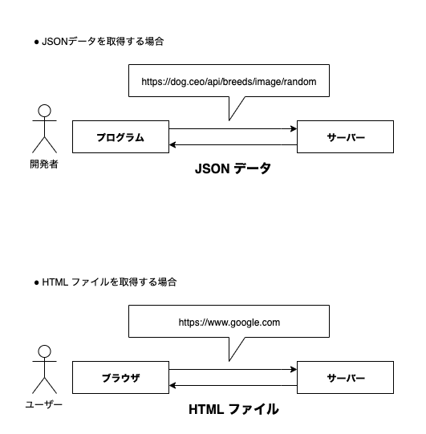

# 今日やること

## 本日のテーマ：**非同期処理**

> - 非同期処理とは、通信などの時間がかかる処理をする際に使われる処理。
> - 関数の実行中の時間を有効活用するために、その関数以外の関数も動く。
> - 関数の記載順と実行順が一致しない。⇨ 非同期処理

JavaScript はシングルスレッド

通信し始めたら「自分の仕事じゃない〜」ってなる

- `SetInterval`
- `SetTimeOut`

## コンテンツ

1. Dog API をVue で使ってみる(20min)
2. Qiita API を使って遊ぶ(60min)
3. Firebase を知る(60min)

## DogAPI を Vue で使ってみる

### WebAPI とは (復習)

教材: [DogAPIで非同期処理](https://geeksalon-exsys.tech/article/recipe2_dog_api) より抜粋

> WebAPI とは、「Web 上で公開されていて、プログラムから利用できるアプリケーション」のこと



### 使い方 (復習)

教材より

```javascript
fetch("https://dog.ceo/api/breeds/image/random")
  .then((res) => {
    return res.json() // 結果を json として読み込んで、次の then に渡す
  })
  .then((data) => {
    imageElement.src = data.message // 画像を表示する
  })
```

### ポイント

WebAPI にデータを取りにいく `fetch` は時間がかかる。(=非同期処理)

- 普通にコードを書き下すと、まだデータ取れてないためエラーが起こる

  ```javascript
  // エラーが起こる例
  const res = fetch("https://dog.ceo/api/breeds/image/random")
  res.json() // => res.json is not a function
  ...
  ```

- そこで、`then` を使う。

  ```javascript
  fetch("https://dog.ceo/api/breeds/image/random")
    .then((res) => {
    return res.json()
  })
  ```

- `then` は、`fetch` が終わるまで待機し、その後動く関数

## (発展) async/await について
